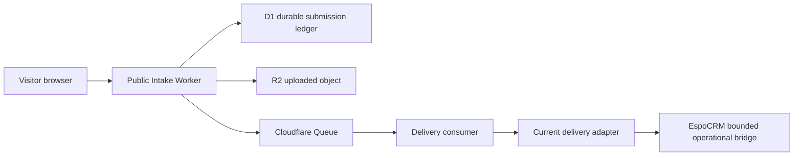
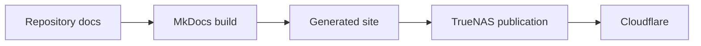

# Infrastructure, Access, and Request Flows

Version: 1.0.1

Status:
Active Architecture

Authority:
Systems Architect Discipline

Governing Proposal:
ACP-006

---

## Purpose

This is the canonical repository reference for verified infrastructure roles,
authentication boundaries, service access, and material request flows.

The governing repository defines architecture. Application repositories and
runtime systems provide implementation evidence but do not silently supersede
this document.

## Product Identity Terminology

[ACP-011](acp/ACP-011-MIDWEST24-CORE-PRODUCT-IDENTITY-AND-SYSTEM-NAMING.md), approved 2026-09-11, supplies the durable product
names used alongside implementation names in this architecture.

| Product identity | Functional boundary | Implementation / adoption state | Hostname |
| --- | --- | --- | --- |
| Midwest24 Core Command | CRM and front office | EspoCRM; bounded by ACP-005 | `command.midwest24.com` |
| Midwest24 Core Enterprise | ERP and enterprise execution | Apache OFBiz candidate; no final selection | `enterprise.midwest24.com` |
| Midwest24 Core Nexus | Future Midwest24-owned custom platform | Reserved for future adoption; repository reconciliation required | `nexus.midwest24.com` |
| Midwest24 Operations | Potential SOP, training, and operating knowledge | Reserved, not adopted | `operations.midwest24.com` |

Technical references to EspoCRM and Apache OFBiz below remain valid. These names
do not establish public availability, final ERP selection, or deployment approval.
The existing `mwg-platform` and `mwg-ops-manual` repositories are not renamed.

## Status Vocabulary

| Status | Meaning |
| --- | --- |
| Current | Supported by current repository or verified implementation evidence |
| Approved | Authorized architecture not necessarily fully implemented |
| Planned | Intended but not verified as implemented |
| Optional | Possible future capability without implementation approval |
| Historical | Formerly used or retained as evidence |
| Obsolete | Superseded and not authoritative |
| Unknown | Available evidence is insufficient |

## Verified Current State

- GitHub stores the governing repository and website source.
- Cloudflare Workers serves the root website described by `wrangler.toml` and
  `worker.js`.
- Current website forms submit to `https://automation.midwestguard.net/webhook`.
- MkDocs Material builds the Russow Institute wiki from `docs/`.
- Generated Institute output is published to
  `/mnt/FastPool/RussowInstituteWiki/` on TrueNAS.
- Cloudflare serves `https://institute.midwest24.com/`.
- ACP-005 authorizes EspoCRM as a bounded interim operational CRM bridge.
- Odoo is not authorized as CRM, ERP, accounting, invoicing, sales, project
  management, or the general operational system of record.

Authentik, Cloudflare Access, Cloudflare Tunnel, Tailscale, Nextcloud, n8n,
and reverse-proxy responsibilities remain Unknown until separately verified.

## Service-Role Register

| Component | Verified role | Status | Evidence |
| --- | --- | --- | --- |
| Governing Git repository | Canonical architecture and institutional memory | Current | Repository Constitution |
| GitHub | Remote source repository | Current | Repository Git state |
| Cloudflare Workers | Root website delivery | Current | `wrangler.toml`, `worker.js` |
| MkDocs Material | Institute wiki build | Current | `mkdocs.yml`, OCP-005 |
| TrueNAS | Institute generated-file publication target | Current | OCP-005 |
| Cloudflare | Public website and Institute delivery | Current | Worker configuration, OCP-005 |
| Cloudflare D1 | Durable public-submission ledger | Approved | ACP-009 |
| Cloudflare R2 | Uploaded application-object storage | Approved | ACP-009 |
| Cloudflare Queues | Asynchronous public-submission delivery boundary | Approved | ACP-009 |
| Delivery consumer | Server-side deterministic delivery and destination-adapter boundary | Approved | ACP-009 |
| Midwest24 Core Command (EspoCRM) | Bounded interim CRM bridge | Approved/current bridge | ACP-005 |
| JobNimbus | Historical operational evidence | Historical | ACP-005 |
| Odoo business platform | Not a current system of record | Obsolete claim | ACP-004, ACP-005 |
| Odoo website builder | Owner-stated role not verified here | Unknown | Implementation evidence required |
| n8n | Possible current legacy webhook consumer; topology remains unverified and n8n is excluded from the ACP-009 approved target architecture | Unknown | Website source, ACP-009 |
| Authentik | No verified repository evidence | Unknown | None identified |
| Cloudflare Access | No verified repository evidence | Unknown | None identified |
| Cloudflare Tunnel | Described only in obsolete material | Unknown | Runtime evidence required |
| Tailscale | Described only in obsolete material | Unknown | Runtime evidence required |
| Nextcloud | Described only in obsolete material | Unknown | Runtime evidence required |
| Reverse proxy | Conflicting obsolete descriptions | Unknown | Runtime evidence required |

## Authentication and Access Boundaries

The public website and Institute publication are intentionally readable without
user authentication.

Administrative Institute publication uses a TrueNAS account through the
documented deployment process. Credential values and private keys are not
documented here.

ACP-005 establishes EspoCRM's bounded operational role, but its authentication,
MFA, API, administrative access, and identity-provider integration remain
unverified in this repository.

Authentik, Cloudflare Access, Tailscale, service-local authentication, MFA, and
FIDO2 responsibilities remain Unknown until verified. No centralized identity
provider shall be represented as implemented merely because it is planned or
available.

## Request Flows

### Public website

### Public form submission — Current legacy implementation

The currently verified website implementation forwards public submissions to
`automation.midwestguard.net`. The browser/website-to-endpoint path is Current.

The webhook-consumer topology, whether n8n currently performs that role,
authentication, validation, retry behavior, durable-acceptance semantics, and
downstream delivery remain Unknown unless separately verified.

ACP-009 does not disable this functioning legacy path merely because a new
target architecture is approved.

### Public form submission — Approved target architecture

ACP-009 approves the following target architecture.

`Approved` means authorized architecture. It shall not be represented as
Current until implementation evidence supports that status.

The approved target preserves the existing same-origin public endpoints:

- `POST /api/lead`
- `POST /api/job-application`

A successful public response means MIDWESTGuard-controlled infrastructure has
durably accepted the submission. It does not mean downstream CRM delivery has
already completed.

The target requires:

- validation, normalization, bounded request/file controls, and abuse controls;
- one immutable submission identifier;
- D1-backed durable submission state;
- R2 object storage for uploaded résumé/application files where applicable;
- queue messages containing bounded identifiers or metadata rather than binary
  file content;
- asynchronous delivery with deterministic state transitions;
- idempotency before downstream mutation;
- bounded retry and recovery;
- persistent delivery-attempt and error evidence;
- server-side protected credentials and least privilege;
- no CRM credential or protected service secret in browser-delivered code.

EspoCRM remains the current bounded operational delivery adapter under ACP-005.

ACP-009 does not authorize production migration to the MIDWESTGuard-owned
application platform.

n8n is not part of the approved target public-intake architecture. Existing
legacy callers or flows shall remain operational until their replacement path
is implemented, validated, recoverable where required, and intentionally cut
over.

### Russow Institute publication

No single remote-administration or service-to-service API flow is fully
verified by this repository.

## Credential-Class Register

This register documents classes, not values.

| Class | Issuer | Holder/consumer | Storage | Revocation | Status |
| --- | --- | --- | --- | --- | --- |
| GitHub authentication | GitHub | Authorized contributor/Git | Approved protected mechanism | GitHub | Current class |
| Cloudflare deployment | Cloudflare | Authorized operator/tooling | Protected environment or credential manager | Cloudflare | Exact mechanism unknown |
| TrueNAS publication | TrueNAS | Authorized operator/SSH | Protected SSH mechanism | TrueNAS | Exact mechanism unknown |
| Website webhook authorization | Unknown | Unknown | Unknown | Unknown | Unknown |
| EspoCRM user/API authentication | EspoCRM | Authorized users/integrations | Protected service or credential manager | EspoCRM | Details unknown |
| Authentik credentials | Authentik | Unknown | Unknown | Unknown | Not verified |
| Tailscale credentials | Tailscale | Unknown | Unknown | Unknown | Not verified |
| Cloudflare Tunnel credential | Cloudflare | `cloudflared` | Never Git | Cloudflare | Not verified |
| n8n credentials | Service issuer | n8n workflows | Protected n8n store if implemented | Issuer/n8n | Not verified |

## Demonstrated Discrepancies

- `get/apply.html` uses `Content-Type: apply/json`; the expected JSON media type
  is `application/json`. This is an uncorrected website implementation defect.
- A secret embedded in browser JavaScript is visible to visitors and cannot be
  confidential.
- Current source uses `automation.midwestguard.net`; obsolete material used
  different `hooks.*` endpoints.
- Directory names, deployment exclusions, and redirects do not make committed
  GitHub content private.
- Generated `.wrangler` account metadata was tracked and is removed by ACP-006.

## Historical Disposition

`Private-Docs/` mixed proposed, obsolete, and purported current state without
reliable provenance. It is removed as current authority; Git history preserves
its bytes. Removal does not prove that every named service is absent.

Empty `Backend-Odoo-Seperate-system/` placeholders, stale `file-tree.txt`, and
superseded `Cloudflare-Config/` copies are also removed.

## Unresolved Verification Register

Verify before promoting any Unknown item to Current:

1. ownership and runtime of `automation.midwestguard.net`;
2. active n8n workflows and topology;
3. Cloudflare Tunnel routes;
4. Tailscale administrative access;
5. Authentik deployment and integrations;
6. reverse-proxy topology;
7. Nextcloud role and access boundary;
8. EspoCRM authentication, MFA, API, backup, and administration;
9. the exact Odoo website-builder boundary;
10. server-side webhook validation, rate limiting, abuse prevention, and data retention;
11. credential owners, storage mechanisms, and revocation procedures.

Verification shall avoid retrieving secret values.

## Architecture Boundaries

This document does not authorize runtime changes.

Planned or Approved integrations are not Current implementation until verified
by implementation evidence. Implementation defects require separate
authorization.

ACP-009 establishes the Cloudflare-native D1 / R2 / Queue public-intake and
asynchronous-delivery model as Approved target architecture only.

Production website cutover, DNS or Worker-route changes, retirement of
functioning legacy callers, and EspoCRM runtime changes require their separately
governed implementation and production authorization.

## Related Standards

- [ACP-009 — MIDWESTGuard Public Intake and Asynchronous Delivery Architecture](acp/ACP-009-MIDWESTGUARD-PUBLIC-INTAKE-AND-ASYNCHRONOUS-DELIVERY.md)
- [Credential and Token Handling Standard](../standards/CREDENTIAL-AND-TOKEN-HANDLING-STANDARD.md)
- [Wiki Presentation Standard](../standards/WIKI-PRESENTATION-STANDARD.md)
- [Knowledge Linking Standard](../standards/KNOWLEDGE-LINKING-STANDARD.md)

## Continue Reading

- [ACP-006](acp/ACP-006-INFRASTRUCTURE-ACCESS-AND-CREDENTIAL-DOCUMENTATION.md)
- [ACP-005](acp/ACP-005-INTERIM-ESPOCRM-BRIDGE-AND-ERP-BETA.md)
- [Website Operations Manual](../operations/WEBSITE-OPERATIONS-MANUAL.md)
