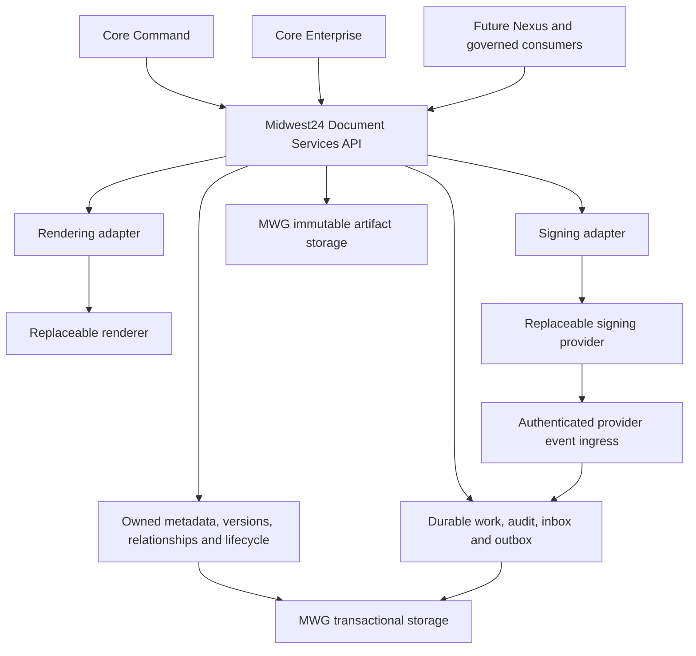

# ACP-012 — Midwest24 Document Services

Version: 0.3.0

Status: Proposed

Type: Architecture Change Proposal

Authority: Systems Architect Discipline

Proposed: 2026-09-12

Scope: Shared document/PDF/e-signature architecture, ownership, contracts,
security, recovery, and synthetic POC planning only.

## Bounded governance approval — 2026-09-12

The governing human explicitly approved `mwg-platform` as the implementation
home for Midwest24 Document Services and the shared-service scope amendment
recorded here. **Status remains Proposed by explicit instruction.** This is a
bounded approval of repository assignment, ownership and planning constraints,
not approval of the complete ACP or authorization to execute Phase 1.

The approved addition to `mwg-platform` scope is one Midwest24-owned shared
Document Services capability, independent of its existing MIDWESTGuard CRM
prototype. `services/document_services/` is the proposed isolated implementation
boundary. It must have independent runtime, dependencies, database, migrations
and credentials, with no CRM model imports. This governing amendment establishes
the scope addition; propagation into candidate repository entry files is the
next separately scoped governance step. No candidate files change now.

Command, Enterprise and future consumers use one shared Document Services
contract. Nexus remains reserved as a future product/consumer; neither this
service nor the repository is renamed or identified as Nexus.

Midwest24 owns document identity, type and template identity/version, lifecycle,
versions, business-record relationships, signer roles and signature-request
state, initiating actor/system, provider mappings, original/completed hashes,
immutable artifact references, audit and retention/disposition metadata.
Provider-specific engines remain replaceable adapters.

Python/Django, PostgreSQL and S3-compatible storage are the preferred stack.
Gotenberg is the initial rendering adapter; Documenso is the preferred initial
signing candidate, with OpenSign retained as an alternative. Exact releases,
required-feature licensing and capability/security evidence remain gated.
All exact Data Hypervisor placement, capacity, network, backup and recovery
facts remain gated until verified; planning preferences are not deployment facts.

All twelve synthetic POC acceptance gates P01–P12 remain **NOT RUN**. POC
implementation, container deployment, integrations and production changes remain
unauthorized. Phase 1 requires separate explicit approval after its scope and
P01 admission prerequisites are resolved. Existing operational document authority
and CRM work remain in force.

This approval authorizes staging and committing only this ACP amendment and
pushing it to `origin/main`. Unrelated Operating Plan/research work and the clean
`mwg-platform` working tree must remain untouched. No new repository is created.

## Current state, evidence, and precedence

Repository context was resolved before drafting. Constitutional governance
precedes engineering standards, operational procedures, implementation guides,
and AI collaboration guidance. Approved architecture governs implementation;
working evidence, vendor documentation, and chat do not promote themselves to
authority. Business semantics remain in `mwg-ops-manual`.

Local inspection baseline (not a fresh remote synchronization assertion):

| Repository | HEAD | Material working-state qualification |
| --- | --- | --- |
| `jryanrussow-site` | `38ca6604ef8361420f7130d77435bb48d9d249bf` | `main`; local upstream comparison 0/0; pre-existing Operating Plan modification and untracked diagnostic records 011/012 |
| `mwg-platform` | `1f253f5022e085b5cfc7dbb3af5156b2e5206c95` | Clean; CRM production-candidate semantic reconciliation remains current work |
| `mwg-espocrm-customizations` | `727d9ce15b1753ff5aaa1b38fcebd04e8c79f15e` | Untracked `validation/acp009/`; not changed here |
| `mwg-ofbiz` | `9b101dfd861e045b930665d2154108de15cab294` | Extensive untracked POC source, documentation and evidence; observations below are working evidence, not committed approval |
| `midwest24-site` | `0ead7cb8961cefebd2ddceb44bd2cb07fe3a4769` | Clean; website/product assets and Archive work, not shared business-document authority |
| `mwg-ops-manual` | `b25a78272da9c15692a87ee4f8f6fbd3365e9a91` | Untracked output artifacts; cited business/infrastructure records are tracked |

Controlling records and findings:

- [ACP-004](ACP-004-DURABLE-OPEN-SOURCE-BUSINESS-PLATFORM.md), Approved:
  software freedom, independent reconstruction, real restore, upgrade survival,
  and maintenance burden are gates, not optional product features.
- [ACP-005](ACP-005-INTERIM-ESPOCRM-BRIDGE-AND-ERP-BETA.md), Approved:
  preserves the bounded EspoCRM operational bridge.
- [ACP-007](ACP-007-MIDWESTGUARD-OWNED-APPLICATION-PLATFORM.md), Approved:
  `mwg-platform` owns the thin prototype; shared document metadata/relationships,
  API and audit conventions are contemplated; commodity PDF/storage/identity
  infrastructure should be reused. Shared scope needs demonstrated value.
- [ACP-008 — owned CRM production candidate](ACP-008-MIDWESTGUARD-OWNED-CRM-PRODUCTION-CANDIDATE.md),
  Approved: conditional advance, no production cutover; binary recovery and
  production-shaped permissions remain to be proved. This is distinct from the
  other ACP-008 concerning skill packaging.
- [ACP-011](ACP-011-MIDWEST24-CORE-PRODUCT-IDENTITY-AND-SYSTEM-NAMING.md),
  Approved: Command is CRM/front office; Enterprise is ERP with OFBiz a
  candidate; Nexus is a future custom product identity; Operations is reserved.
  Technical implementation names do not determine product identity.
- `mwg-ops-manual/docs/OCP-006-ESPOCRM-DOCUMENT-JOB-FILE-ARCHITECTURE.md`,
  Approved: Espo native Document owns current interim managed-file behavior;
  many-to-many Contact/Opportunity/Job/Work Order relationships avoid physical
  duplication. Electronic signatures, generation and retention are deferred.
- `mwg-ops-manual/02-Operations/Business-Capability-Catalog/capabilities/001-lead-acquisition-qualification/data-standards/signed-contract-handoff-standard.md`,
  Approved: BR-038 requires a valid executed contract; preserve the same managed
  document through upstream/downstream relationships. Provider completion alone
  does not establish business validity or invent downstream lifecycle rules.
- `mwg-platform/docs/architecture/GATE-4-PLATFORM-CONTROLS.md` and
  `mwg-platform/mwg_crm/models.py`: ManagedDocument has one storage key and
  multiple relationships; storage integration is deferred. AuditEvent rejects
  application edits/deletes but does not prove database-level immutability.
  OIDC and record-level sharing are deferred. No shared render/sign API was
  found in the inspected prototype source/documentation.
- `mwg-espocrm-customizations/custom/Espo/Custom/Resources/metadata/entityDefs/Document.json`
  implements the audited category and Job/Work Order links. This is evidence
  to preserve, not authority to replace native storage.
- `mwg-ofbiz/docs/REPRESENTATIVE-BUSINESS-POC-SPEC.md` describes document
  ID/revision/hash references and Content/DataResource/WorkEffortContent as
  candidate attachment mechanisms. Its contract fixture is explicitly not a
  real electronic signature. This proposal does not adopt its uncommitted
  implementation assumptions as enterprise policy.

Infrastructure evidence is reconciled below. No service capability or operational
integration is represented as implemented by this proposal.

## Problem, ownership, and alternatives

Separate Espo, OFBiz and custom rendering/signing systems would duplicate
document identity, lifecycle, audit and recovery responsibility. Depending on
a signing provider's IDs or database would make replacement a domain migration.
The reusable unit is a document service, not a new CRM, ERP or generic workflow
builder.

| Location | Assessment |
| --- | --- |
| `mwg-platform` | Approved implementation home under the bounded approval above: already owns shared platform conventions and prototype document semantics; avoids another repository. Risk: CRM coupling and scope creep; mitigate with a separate module, own persistence and external record references, no imports of CRM models into its domain. |
| New dedicated implementation repository | Reasonable later if ownership, release/security isolation or maintenance evidence requires it. Deployment independence alone does not require a new repository. Not authorized or named here. |
| Espo or OFBiz repository | Own only their adapters; neither owns the shared service or a second engine. |
| `jryanrussow-site` | Owns cross-system architecture and this proposal, not service runtime source. |
| `mwg-ops-manual` | Owns document taxonomy, templates' business approval, signature authority, retention, operating procedures and accountable business ownership. |
| `midwest24-site` | Product presentation/assets and its governed applications; not this service's implementation home. |

Reuse the existing metadata concepts through a later explicit mapping; do not
silently promote or relocate `mwg_crm.ManagedDocument`, change its IDs, or share
its ORM tables with consumers. Initial service records are synthetic and new.
Future governed adapters map existing identities without replacing records.

## Implementation-home assessment — 2026-09-12

**Assessment result: APPROVE `mwg-platform`.** The governing human accepted this
recommendation through the bounded approval above. ACP-012 remains Proposed;
ACP-007/ACP-008 alone do not authorize the new service. The shared-service scope
addition preserves the CRM production-candidate workstream. Phase 1 execution
still requires separate explicit approval and P01 admission evidence.

Fresh local baseline: governing repository `main` at
`24abd2b372fbd355616ff864ac2773d5dddfbdb3`; candidate `main` at
`1f253f5022e085b5cfc7dbb3af5156b2e5206c95`. Both compare 0/0 with their local
`origin/main` references; no fetch or remote freshness claim. Governing
Operating Plan edits and untracked diagnostic records 011/012 predate this
assessment and are preserved. Candidate working tree is clean.

The governing repository has no root AGENTS.md; START-HERE and its context
resolver establish entry authority. Its README describes the website, while
REPOSITORY-CONSTITUTION establishes the broader discipline authority. Candidate
AGENTS, START-HERE, README, Operating Plan, Authority Map, Prototype Scope and
Gates were inspected. Its bootstrap commit is `603e40e`; latest commits record
Gate 8, Gate 9 and ACP-008 Phase 1 semantic reconciliation. The README's Gate 2
language is historical and does not describe current capability completeness.

ACP-007's Prototype Repository and MWG Platform Core Boundary sections establish
an owned application-platform prototype with a thin reusable core. This is
application/domain source, tests, migrations and implementation evidence, not
an infrastructure-only repository or an unrestricted shared-service catalog.
Current top-level Python packages are `mwg_crm`, `platform_core` and
`mwg_platform`; supporting paths are `tests`, `scripts/recovery`, and
`docs/architecture`, `docs/domain`, `docs/operations`. There is local development
Compose configuration but no tracked CI workflow or independent service release
pipeline. Existing capabilities include CRM relationships, permission-checked
Contact API, activities, metadata-only ManagedDocument, audit, deterministic
automation, bounded AI proposals and recovery tooling. Gate 4 explicitly defers
object storage; its audit protection is application-level. None proves this
service's rendering, signing, binary recovery or stronger integrity gates.

Document Services fits the thin owned application-layer purpose after a scoped
extension: two named consuming systems provide concrete cross-application value.
The `mwg` name and MIDWESTGuard-only mission create ownership ambiguity for a
Midwest24 shared capability. Clarify the technical repository name and per-module
ownership in existing entry files; retain the repository name and reserve Nexus.
Do not turn the CRM prototype into the service or promote its ORM tables.

| Criterion | A — `mwg-platform` | B — New dedicated repository | C — Existing consumer/governance repository |
| --- | --- | --- | --- |
| Architectural fit | Good after explicit ACP-012 scope addition; thin owned application code | Good after new governed mission/bootstrap | Espo/OFBiz appropriate for consuming adapters only; governing/site/ops repositories have different responsibilities |
| Cohesion | Related owned capabilities; enforce independent module, no CRM domain imports | Strong single-service cohesion | Shared runtime would mix consumer or documentation responsibilities |
| Deployment independence | Separate entrypoint, image, DB and migration command required | Natural separate build, still needs runtime isolation | Possible technically; encourages host-application coupling |
| Ownership clarity | README must name Midwest24 service owner separately from MIDWESTGuard CRM | Clear service mission; accountable operator still must be assigned | Consumer ownership would misstate shared authority |
| Command/Enterprise/future Nexus reuse | Same external contract; no consumer ORM dependency | Same external contract | Privileges one consumer; Nexus remains reserved |
| CI/CD boundary | Add service-scoped build/tests and release approval; shared-library changes trigger all affected checks | Separate pipeline, additional bootstrap and maintenance | Consumer pipeline would become service release gate |
| Secrets/config boundary | Dedicated service identities, environment and protected stores; no CRM credentials | Easier repository separation, still requires runtime least privilege | Risk of borrowing consumer credentials and privileges |
| Upgrade/release independence | Own dependency lock, artifact/version, migrations and rollback; no CRM release prerequisite | Naturally separate cadence, duplicated tooling | Tends to follow consumer upgrades and release cadence |
| Maintainability | Reuse language/tooling knowledge; police coupling and measure burden | Additional repository/dependency/CI administration; justified if isolation cannot be maintained | Highest conceptual coupling and divided authority |
| Naming | Broad platform name fits technical role; Midwest24 ownership needs explicit text | Service-specific name clearer, but none proposed or created | Consumer/site/ops names misdescribe shared runtime |

Option C uses the responsibility evidence already recorded above and ACP-007;
no additional repository inspection was necessary. A preliminary discovery
command listed AGENTS.md paths outside the two primary repositories before the
attachment's restriction was applied; no unrelated file contents were opened.
Subsequent inspection stayed within the two primary repositories. Choose B later
if separate maintainers/access controls or observed release coupling demand it;
repository separation alone does not establish data or deployment isolation.

## Concrete Phase 1 plan supplement

The existing domain table, API contract, infrastructure prerequisites and
P01–P12 below remain controlling; this supplement makes their execution scope
precise without authorizing implementation.

Use one fixture set `synthetic-contract-001`: one marked test-only Contract
HTML template `synthetic-mwg-contract` version `1`, one versioned input snapshot,
one synthetic customer signer, one operator and distinct Command/Enterprise
stub workload identities in one synthetic organization. Create fake Opportunity,
Job and Work Order references as external identifiers; no CRM database or
business conversion is invoked. One local email sink captures the invitation.

Flow: create owned document → render PDF → store original and SHA-256 → create
one owned signature request through the adapter → human completes test signing
in the isolated provider UI → authenticate and durably record callback → fetch
and verify completed PDF/evidence → store separately under immutable references
and SHA-256 → commit completion/audit/outbox → relate the same document to the
fake MWG Job and Work Order → both consumer stubs retrieve the same version/hash.
The original bytes and Opportunity relationship survive every step.

For deterministic POC identity, use UUIDv5 with a fixed, published synthetic
namespace and an unambiguous canonical encoding of fixture organization,
consumer instance, operation and idempotency key. Freeze that namespace and
encoding in the approved fixture before implementation. Identical replay in a
fresh environment produces the same document ID; changed payload with the same
key returns conflict, and a new key creates a new identity. IDs contain no
provider identifier, personal data or mutable document content. UUIDv5 is only
an identifier mechanism; artifact integrity remains SHA-256. Production ID
allocation is a later contract choice; opaque stable ownership is controlling.

Minimum assertions map to the existing gates: P02 verifies durable document
creation, deterministic fixture ID, template/version and original PDF/hash;
P03 binds signer role, exact bytes and owned request; P04 authenticates ingress
and stores completed bytes separately before announcing completion; P05 tests
identity/idempotency conflict and recovery; P06 verifies both hashes and lifecycle
reconstruction; P07 verifies relationships; P09/P10 perform actual independent
restore; P11 isolates provider IDs in ProviderBinding and adapter records, and
substitutes contract-test adapters. No minimum assertion replaces P01–P12, and
no gate passes by documentation alone. Every gate needs recorded expected and
actual results plus evidence references; any unmet requirement blocks POC
acceptance. Gates are currently NOT RUN.

### Candidate stack and repository layout

Prefer Python/Django using the candidate's existing ordinary Django JSON-view
approach, PostgreSQL and Psycopg, pytest/pytest-django and Ruff. Its checked-in
baseline pins Django 5.2.17; this is repository evidence, not a new version or
security approval. Validate supported releases and license/security manifests
at P01. Do not introduce DRF, a new language, or a shared runtime dependency
merely to make this service. A PostgreSQL-backed durable worker/inbox/outbox
can avoid adding a broker for this one-workflow POC.

Keep Gotenberg first for rendering and Documenso conditional first for signing;
OpenSign is the fallback candidate subject to the same exact-release license,
API, webhook, assurance and export gates. PostgreSQL owns metadata/audit and a
separate S3-compatible adapter owns artifact access on verified Data Hypervisor
storage. Provider state may need its own engine; never assume it shares the
service database. These are replaceable candidates, not permanent architecture.

Official documentation rechecked for this assessment: [Gotenberg routes](https://gotenberg.dev/docs/getting-started/routes),
[Documenso verification](https://docs.documenso.com/docs/developers/webhooks/verification),
and [OpenSign API](https://docs.opensignlabs.com/docs/API-docs/v1.2/opensign-api-v-1-2/).
Documenso currently documents a shared-secret header, not a payload HMAC or
signed timestamp. Require nonempty configured secret, constant-time comparison,
TLS, durable deduplication and authenticated status/artifact reconciliation;
do not copy its example's missing-secret bypass. Pin and verify actual release
behavior at P01. A callback alone cannot establish completion or signer validity.

Proposed paths follow the existing snake_case Python, Django migrations,
pytest and recovery-script conventions while isolating service dependencies:

```text
services/document_services/
  manage.py
  requirements.in
  requirements.lock
  pyproject.toml
  compose.yaml
  config/                     # separate settings, URLs, process entrypoints
  document_services/
    api/
    domain/
    adapters/rendering/
    adapters/signing/
    adapters/storage/
    persistence/              # Django app/models and migrations
      migrations/
    workers/                  # durable work, inbox and outbox processing
  tests/
  fixtures/
  scripts/recovery/
docs/architecture/            # existing location for future POC evidence
```

The `services` container is a proposed addition, not a current convention.
The independently deployable subtree avoids changing the root CRM entrypoint,
settings, dependency lock or migration graph. No import of `mwg_crm` models,
no cross-database foreign keys and no shared tables. Reuse conventions before
extracting shared libraries. A later service-scoped CI workflow must select this
subtree explicitly; dependency locks, build contexts and recovery commands must
prove that a service release does not require a CRM release. No paths above
are created in this transaction.

### Exact governance file boundary

Only this ACP is modified now, as a Proposed amendment. No redundant plan/OCP
is created and neither Operating Plan is activated or reprioritized.

The bounded approval is recorded in this ACP. The remaining scope propagation
requires a separate documentation transaction; the exact file boundary is:

| Repository / exact path | Bounded change |
| --- | --- |
| `jryanrussow-site/docs/architecture/acp/ACP-012-MIDWEST24-DOCUMENT-SERVICES.md` | Completed here: record bounded approval, retain Proposed status, and exclude Phase 1 authorization |
| `jryanrussow-site/docs/architecture/INFRASTRUCTURE-ACCESS-AND-REQUEST-FLOWS.md` | Add Approved target reference, preserving Unknown deployment facts |
| `jryanrussow-site/docs/discipline/OPERATING-PLAN.md` | Concise bounded architecture closeout after approval; preserve unrelated local work and active objective |
| `mwg-platform/README.md` | Name CRM and separately authorized Midwest24 shared-service responsibilities; clarify technical name; distinguish historical Gate 2 from present CRM state |
| `mwg-platform/AGENTS.md` | Add ACP-012 authority, isolation and no-production constraints; reference central model-selection rule without duplicating it |
| `mwg-platform/START-HERE.md` | Add ACP-012 and service-specific scope to applicable entry reads; preserve existing CRM entry sequence |
| `mwg-platform/docs/architecture/AUTHORITY-MAP.md` | Distinguish ACP-007/008 CRM authority from the bounded ACP-012 shared-service approval and operational business authority |
| `mwg-platform/OPERATING-PLAN.md` | Record approved home and separately gated P01–P12 work item without silently replacing CRM semantic reconciliation |

Do not rewrite historical ACP-007, ACP-008 or PROTOTYPE-SCOPE/GATES into shared
service authority. Reference ACP-012 instead. Before actual Command integration,
`mwg-ops-manual/docs/OCP-006-ESPOCRM-DOCUMENT-JOB-FILE-ARCHITECTURE.md` needs a
separately governed extension. Consumer implementation paths require later local
context and are deliberately not invented here. No platform edits are needed
for this bounded governing-repository transaction. The next governance step is
to authorize and apply the five candidate entry/context amendments listed above,
then resolve the P01 admission evidence and obtain separate explicit Phase 1
execution approval. Do not interpret this commit as that approval.

## System boundary



Document Services owns identity, byte-version integrity, lifecycle transitions,
provider correlation, evidence retention and authorized retrieval. Business
systems own customer/job/work-order semantics and business decisions. The
service does not own job creation, accounting, sales conversion or Job File
Complete. AI may propose classifications only; authoritative state and queues
remain transactional, and operation must continue without AI.

## Domain and data model

Identifiers are opaque Midwest24-assigned stable IDs, independent of provider,
database engine and source-system identifiers. Use UTC timestamps with separate
provider occurrence and local receipt/recording times. Preserve schema versions.

| Record | Required fields and constraints |
| --- | --- |
| Document | `document_id`, organization/security boundary, governed `document_type`, classification/category and vocabulary version, title, source system/instance, source entity type/ID, initiating actor, creation time, lifecycle, current version reference, concurrency revision, retention-policy reference, disposition state |
| TemplateVersion | Owned template ID and immutable version, template artifact/hash, input-schema version, business approval reference/status, locale, render profile, signing-field/role schema; provider template IDs are adapter mappings only |
| DocumentVersion | Version ID and sequence, document ID, parent/input version, purpose (source/rendered/completed/evidence), MIME type, byte count, hash algorithm/value, immutable artifact locator/object version, created time, creator, template version, input snapshot/hash, renderer/profile/dependency provenance; unique document/sequence |
| BusinessRelationship | Relationship ID, document ID, optional exact version, source system plus instance, entity type/ID, relation purpose, authorizer, created/ended event references; multiple relationships do not duplicate bytes or grant access by themselves |
| SignatureRequest | Owned request ID, exact input version/hash, requested policy/profile version, request state, signer set/order, initiator and executor, creation/expiry/completion times, provider binding, completion/evidence version references, correlation/idempotency key |
| Signer | Stable local party/subject reference where known, name/contact snapshot protected as personal data, business role, required action/order, authentication method and assurance observed, consent/disclosure version and event, signing outcome/time, provider-recipient mapping; no invented verified identity from an email address |
| ProviderBinding | Provider identity and instance, adapter/API version, provider transaction/recipient/template IDs, operation attempts, safe error code, reconciliation state; uniqueness includes instance, not provider ID alone |
| AuditEvent | Event ID, document/version/request references, per-document sequence, event/schema version, initiating human/system, executing service, source, action, old/new state, result/reason, occurred/received/recorded timestamps, correlation/causation IDs, payload/evidence digest, policy decision reference, previous-event digest |
| Work/Inbox/Outbox | Operation/event ID, idempotency namespace/key and request digest, aggregate revision, durable state, attempts/lease/retry time, provider event ID or dedup digest, delivery receipts; survive process and queue loss |
| Retention/Hold | Policy/version, retention trigger/date, review date, legal/operational hold and authority, disposition approver/reason/time, tombstone and deletion evidence; no default duration or automatic purge invented here |

Keep original and completed hashes as references to their exact immutable
versions, not mutable fields that overwrite earlier evidence. Retain original
template inputs needed for reconstruction under equivalent access controls;
put their hash/reference, not personal payloads, in audit logs. A byte hash
proves integrity, not customer consent or legal validity.

Proposed technical states are separate from business vocabularies:

- Document: draft → ready → signing → completed; cancellation/supersession
  preserve history. Disposition is a separate controlled process.
- Render operation: queued → running → succeeded/failed; retry keeps the
  operation's identity and produces no duplicate accepted version.
- Signature request: queued → sent → in_progress → finalizing → completed;
  declined/cancelled/expired are terminal alternatives; ambiguous provider
  outcomes enter reconciliation_required rather than starting another request.

Only policy-valid transitions commit, with optimistic revision checking and
transactional audit/outbox writes. Freeze the signing input version. A correction
creates a new version/request and explicitly cancels or supersedes the old
request. Do not silently change the bytes a signer was asked to accept.

## API and event contract

No universal route standard was established by the inspected prototype's
Contact API. Propose `/v1` JSON contracts below; exact OpenAPI schemas belong
to the separately approved Phase 1 specification, not provider SDKs.

| Contract | Behavior |
| --- | --- |
| `POST /v1/documents` | Validate type, source references, authority and template/source-artifact reference; allocate document ID; return 201 only after durable metadata acceptance |
| `POST /v1/documents/{id}/render` | Exact template/input/profile versions; authorize action; return 202 and operation ID; eventual output is a new immutable version |
| `POST /v1/documents/{id}/signature-requests` | Exact ready version, signers/roles and policy; return 202 and owned request ID; provider allocation is asynchronous |
| `GET /v1/documents/{id}` | Authorized metadata, lifecycle, revision and safe references; provider diagnostics restricted |
| `GET /v1/documents/{id}/versions` | Cursor-paginated immutable version metadata and hashes |
| `GET /v1/documents/{id}/audit` | Authorized cursor-paginated evidence with stable ordering and redaction appropriate to caller |
| `POST /v1/signature-webhooks/{provider}` | Adapter-specific authenticated ingress; registry resolves provider instance; durable inbox receipt before 2xx; never a business-client API |
| `GET /v1/operations/{id}` and `GET /v1/signature-requests/{id}` | Poll durable progress, retry/reconciliation state and result references |
| `GET /v1/documents/{id}/versions/{version}/content` | Reauthorize exact version; stream bytes through service for initial POC; no permanent provider URL or raw storage credential |
| `POST /v1/documents/{id}/relationships` | Validate trusted source mapping and document/link permission; record relationship event without broadening access |

Explicit version upload, signature cancellation, retention holds and evidence
export need governed contracts before corresponding phases use them. The POC
uses governed template generation and needs no arbitrary public upload route.

Mutations require an idempotency key scoped to organization, caller and operation.
Identical retries return the original result; changed content with the same key
returns conflict. Use 401 for missing/invalid credentials, consistent 403/404
policy for inaccessible objects, 409 for revision/state/key conflicts, 422 for
schema/policy/unsupported capability, 429 for rate limits, and retryable 503 for
temporary availability. Errors carry stable codes, request/correlation IDs and
retry guidance without secrets. Bound sizes, timeouts and pagination.

Events include `document.rendered`, `signature.requested`,
`signature.completed`, `signature.declined`, `document.relationship_added` and
operation failures. Envelope: event ID/type/schema version, organization,
document/version/request IDs, sequence, occurrence/recording time, correlation
and causation, actor/executor and minimal payload. Delivery is at least once;
consumers deduplicate by event ID and detect sequence gaps. A durable outbox
supports retry, dead-letter review and replay after restore; no promise of
exactly-once transport. Consumer endpoints are registered and allowlisted.

Provider completion is only an input. Authenticate and persist it, reconcile
against the bound provider transaction, retrieve final bytes/evidence through
the adapter, verify the result, store and hash the immutable artifacts, then
commit completed state and its event. Missing bytes leave finalizing state;
they do not announce a completed durable document.

## Rendering and signing abstractions

Rendering port: `render(template_version, input_snapshot, render_profile)` →
bytes/content type plus engine/provenance and safe diagnostics. Midwest24 owns
template identity, input schema, fonts/assets and versioned render profiles.
Output need not be byte-identical across engines; retain actual bytes and their
hash, and compare agreed layout/content requirements during replacement.

Signing port: `capabilities`, `create_request`, `get_status`, `cancel_request`,
`fetch_completed_artifact`, `fetch_evidence`, and `verify_and_normalize_webhook`.
Translate provider IDs, state names, recipients, field coordinates and signature
evidence into owned records. Provider extensions stay namespaced and optional;
unsupported required assurance/roles/fields must fail explicitly. Never downgrade
signature assurance to make another provider pass.

Provider create timeouts are ambiguous side effects. Reconcile by stored request
reference/provider lookup before retrying; if the provider cannot establish the
outcome, require review. Switching providers applies to new requests. Keep an
in-flight request bound to its provider or explicitly cancel/reissue it; never
pretend its signatures transferred to another engine.

Initial evaluation, based on official documentation accessed 2026-09-12:

| Candidate | Evaluation and gate |
| --- | --- |
| Gotenberg | First rendering candidate: official routes support HTML and office conversion. Verify pinned version, licensed dependencies/fonts, layout, resource limits and hostile-input isolation. [Routes](https://gotenberg.dev/docs/getting-started/routes) |
| Documenso | First signing candidate for the POC, conditional on software-freedom and security gates. Official developer docs describe self-hosted APIs and migration toward envelopes: a concrete reason to isolate its schema. Webhooks require team context; private-address delivery needs narrowly configured self-hosted handling. Verify edition/API/evidence export and all runtime dependencies at an exact release. [Developer guide](https://docs.documenso.com/docs/developers), [webhook setup](https://docs.documenso.com/docs/developers/webhooks/setup), [verification](https://docs.documenso.com/docs/developers/webhooks/verification) |
| OpenSign | Alternate signing candidate. Official API covers signing and webhooks; webhook documentation describes HMAC authentication and paid live-plan boundaries. Self-hosted required-feature availability remains unresolved: verify exact source/edition rather than infer freedom from branding or hosted sandbox success. [API](https://docs.opensignlabs.com/docs/API-docs/v1.2/opensign-api-v-1-2/), [webhooks](https://docs.opensignlabs.com/docs/help/Settings/Webhook/) |
| S3-compatible storage | Proposed protocol, not an installed product assertion. Select an MWG-hosted implementation only after testing conditional writes, object versions, policy enforcement, retention, export and restore. Compatibility alone does not prove object-lock semantics. |
| PostgreSQL | Preferred metadata/audit candidate consistent with ACP-007 and existing prototype experience. Give the service its own database/roles; exact supported version and recovery configuration remain Phase 1 decisions. Another governed transactional engine must preserve the same constraints and export contract. |

No candidate has passed this service's POC. Record ACP-004 feature classifications
for rendering, API, signing, webhooks, evidence export and recovery. A required
unapproved proprietary dependency fails the gate. Pin source/image digests,
license evidence and upgrade/rollback procedures before execution; do not adopt
unversioned vendor examples as a security design.

## Data Hypervisor placement and unresolved infrastructure facts

`mwg-ops-manual/02-Infrastructure/truenas-goldeye.md` identifies TrueNAS SCALE
Goldeye as the Data Hypervisor, FastPool for applications/config/databases and
IronWolfPool for user files/long-term storage. ACP-007 permits following that
architecture. No capacity, new dataset name or current service installation is
inferred from it.

`mwg-ofbiz/docs/POC-RECORD.md` supplies newer working evidence for a dedicated
FastPool/AppData POC dataset and `IronWolfPool/Backups` recovery storage. These
are OFBiz allocations, not document-service allocations. Older storage docs
list lowercase `backups`; exact spelling and current placement require verified
inventory. Do not reuse either OFBiz runtime or backup directory.

The canonical [Infrastructure, Access, and Request Flows](../INFRASTRUCTURE-ACCESS-AND-REQUEST-FLOWS.md)
still marks Authentik, proxy and several access integrations Unknown despite
broader claims in operations documentation. Preserve that uncertainty for
current-state assertions. Proposed integration is not verified deployment.
The general `backup-strategy.md` and disaster-recovery `overview.md` in the ops
repository are empty; links to them cannot establish policy or restore success.

| Concern | Proposed placement / required verification |
| --- | --- |
| Compute | Isolated service and worker/provider processes on approved Goldeye application compute; resource limits, health checks and off-server builds where appropriate. Other approved compute may replace it while durable state stays on MWG storage. AI Worker is not required. |
| Database/config | Dedicated service database and credentials; persistent storage in the documented FastPool application class. Select exact dataset, permissions, quota, engine and ports from fresh non-secret inventory before deployment. |
| Documents | Dedicated private object-store namespace backed by the documented IronWolfPool durable-file class; separate temporary/quarantine area. No direct use of Nextcloud internals, provider URL as archival authority, or consumer-owned storage copy. |
| Provider state | Dedicated MWG-controlled persistence for any provider database, templates, pending requests, keys and evidence not yet ingested. A provider may require another database; inventory and recover it rather than assuming everything runs in PostgreSQL. |
| Snapshots | Snapshot before risk; coordinate database checkpoint/backup and object manifest. Uncoordinated filesystem snapshots alone do not prove transactionally consistent recovery. |
| Replication/backup | Select verified independent failure-domain target, access controls and schedule under MWG custody; same-host second-pool copy is staging, not host-loss recovery. No external cloud replication destination is selected. |
| Secrets/certificates | Ops documentation identifies Vaultwarden custody; governing credential standard allows protected service-native/runtime stores. Verify actual integration and recovery, never place vault master credentials into application images. Signing private keys and TLS keys are distinct. |
| Network | Private service/provider network, no database/object-store public ports; least-privilege authenticated TLS between trust boundaries. Initial human test through loopback/approved administrative tunnel; no public tunnel, DNS or production proxy change. |

ACP-009's approved Cloudflare D1/R2/Queue public-intake architecture remains
separate. It is not precedent to put canonical document-service artifacts in R2.
Any later transfer from intake must preserve provenance through an explicit
governed adapter; it is not part of this POC.

## Identity, authorization, and integrity

Use distinct revocable workload identities per consumer and provider adapter.
Prefer short-lived audience/scoped service tokens over TLS, with issuer,
signature, expiry and audience validation; mTLS may bind workloads where the
approved identity infrastructure supports it. The exact issuer/protocol and
provisioning remain deployment gates. A private network alone is insufficient.

Human authority comes from verified subject/group/role policy, not an untrusted
`user_id` header or a provider account. Carry initiating human and executing
service separately, with authenticated delegation or a verified authorization
decision. Service-initiated actions name the accountable workload explicitly.
Reevaluate permissions at download, signing dispatch, relationship changes and
retry execution; revoked authority must not persist silently in queued work.

Document-level policy checks organization, classification, authorized business
context, action and exact artifact. Source systems supply trusted record-access
decisions or explicitly governed grants, not arbitrary caller assertions. Deny
by default on missing/stale mapping or unavailable required policy authority.
Linking a document to another Job/Work Order does not automatically grant all
participants access. Test list, audit, export and download paths as well as UI.

Signer identity is separate from employee identity. Record actual authentication
method/assurance, consent, disclosures, intent, roles and delegation evidence.
An emailed link or visible signature image alone is not strong identity proof.
The synthetic POC uses a test signer and captured invitation; production signer
assurance and business validity require operational/legal policy approval.

Verify webhook authentication using the exact pinned provider protocol and raw
request bytes where required; constant-time MAC comparison, timestamp/replay
controls where supported, persistent event deduplication and strict transaction
binding. If signed timestamps are unavailable, record that limitation and use
authenticated provider reconciliation before accepting final state. Do not
fetch arbitrary callback URLs: retrieve through configured provider endpoints
with restricted egress and redirect handling. A forged callback has zero domain
side effects. Secure callback receipt does not establish the validity of the PDF.

Renderer processes accept packaged governed inputs, with CPU/memory/time/size
limits, restricted filesystem, no service secrets and deny-by-default network
egress. Disable arbitrary URL rendering for the POC. Quarantine/validate content
before acceptance; enforce MIME/size limits and a governed malware policy before
general uploads. Sanitized logs exclude tokens, signing links and document data.

For every credential class (workload token, provider API credential, webhook
key, DB/object credential, TLS key, signing key, backup encryption key), Phase 1
must record issuer, owner/custodian, consumer, protected store, transmission,
rotation/revocation/recovery method, source-control exclusion and verification
state under the credential standard. Record references and fingerprints only.

Each accepted artifact has a SHA-256 digest (or separately governed successor),
algorithm label, byte length and immutable version reference. Preserve original,
rendered signing input, completed PDF and separate provider evidence. Never
rerender, optimize, stamp or silently overwrite a completed signed artifact.
Derivatives require a new explicitly related version.

Use write-once object keys/versions, conditional creation and IAM denying runtime
overwrite/deletion. Finalization verifies stored bytes before publishing state.
Application audit checks alone are insufficient: use separate append-only
database privileges/control, durable ordered events, chained digests and an
independently protected checkpoint/backup to detect privileged rewriting.
Hash chaining without a protected anchor does not prevent an administrator from
rewriting the chain. Administrative recovery/disposition actions remain audited.

Capture cryptographic signature/seal certificates, fingerprint/chain, validation
result, validation-tool version/time and timestamp/revocation evidence where
supported, separately from signer intent. Use maintained validators; unsupported
evidence is recorded as unavailable. Do not claim trusted timestamps, PAdES/LTV
or legal enforceability merely from a successful provider response. Do not build
custom cryptographic PDF code.

Retention holds block disposition. Production durations, jurisdictional rules,
authorized destruction and treatment of backups need business approval; the POC
uses retain-until-review for synthetic evidence. Metadata tombstones preserve
authorized disposition history without retaining forbidden document payloads.

## First consumer integrations

Core Command's eventual adapter requests an approved template/version, binds
customer/Contact and Opportunity context, sends an exact version for signature,
receives normalized status, retrieves the final PDF and preserves the same
document/version/audit reference when a Job and Work Orders are related.
Reconcile source IDs using system/instance/type/ID, not display names.

The service reports signature evidence; the authorized business process decides
whether BR-038 is satisfied. Preserve Lead, Opportunity, Account/customer,
Contact, Property, required intake fields, salesperson, appointment context,
claim context where applicable, notes, conversion time and accountable actor
in the handoff owned by the business system. Do not move all those records into
the document service or automatically declare Job File Complete.

Before Phase 2, amend or supplement ops OCP-006 explicitly for service-backed
documents: define Espo's native Document projection/reference and permissions,
owned service identity, reconciliation and failure behavior. Existing native
Documents/Attachments/Notes/RealEstate behavior and bytes remain authoritative
under current scope. No duplicate custom engine or migration is implied.

Core Enterprise uses identical service IDs, versions, hashes and events through
an OFBiz-owned adapter. Candidate native Content/DataResource/WorkEffortContent
links are projections of references, subject to verified source mapping and
record access. OFBiz owns its business workflows, not rendering/signing truth.
Do not infer an ERP Job ID from an Espo ID; approved identity mapping is required.
Offline retry preserves references without inventing completion. Both adapters
must tolerate duplicate/out-of-order events and reconstruct missed state from
the service. Neither needs direct access to provider databases or buckets.

## Smallest synthetic POC and acceptance criteria

Use one clearly marked synthetic MIDWESTGuard Contract template/version, one
synthetic customer signer, one operator and one service identity; a fake upstream
Opportunity and MWG Job with a Work Order relationship. No real contract terms,
customer records, external recipients or production credentials. Capture all
outbound email in a local sink. One real self-hosted signing candidate and one
renderer run in an isolated environment only after separate Phase 1 approval.
Stub consumers represent Command and Enterprise; their production systems are
not called. Human signing occurs in the isolated provider UI.

| Gate | Required evidence |
| --- | --- |
| P01 Admission | Approved scope, pinned dependency/license manifest, synthetic provenance, exact isolated storage/network/identity map, resource ceilings and rollback plan; existing workloads unaffected |
| P02 Render/store | Template and input versions recorded; readable expected PDF, required content/fields/fonts/pages verified; stored byte hash matches retrieval; source remains available |
| P03 Request/sign | One owned request binds exact input hash and signer role; local invitation and real test signing complete; evidence records observed authentication and consent |
| P04 Webhook/finalize | Authentic callback causes durable inbox then verified artifact/evidence ingestion and one completion event; forged callback denied; duplicate and out-of-order callbacks do not regress state |
| P05 Failure/retry | Three identical requests and concurrent duplicates yield one business result; changed payload/key conflicts; provider timeout reconciles without duplicate send; missing callback recoverable by polling; crash after object write and before DB commit reconciles safely |
| P06 Integrity/audit | Original/completed SHA-256 match independent checks; attempted overwrite/audit edit is denied; altered artifact/checkpoint is detected; exact initiator/executor/provider chain reconstructs the history |
| P07 Relationships | Same owned document visible through fake Opportunity/Job/Work Order references without byte copies; second fake consumer reads identical version/hash; linking does not broaden access |
| P08 Access | Unauthorized human/workload, wrong organization, other Job/trade, expired/revoked credentials, guessed artifact IDs and replayed callbacks fail without disclosure or domain writes |
| P09 Recovery | Restore database, artifacts, audit, template, identity/policy references, keys and provider state into a fresh isolated environment; independent manifest/count/hash comparison and a download succeed; pending work resumes without duplicate signing/notification |
| P10 Failure domain | Recover from an independently held MWG-controlled backup with original service storage unavailable; same-host snapshots alone do not pass; record measured recovery time and loss against approved POC targets |
| P11 Replacement boundary | Disable original provider; completed document/evidence still retrievable; substitute contract-test renderer/signing adapters for new synthetic requests with unchanged client contracts/IDs/schema; no SDK/provider types escape the adapters |
| P12 Exit and review | Reconstruct neutral metadata/relationships/events plus ordinary artifact files without provider DB access; report license gaps, maintenance steps, failures and open risks; obtain review before Phase 2 |

P11 proves the abstraction, not full interchangeability of two production signing
engines. A second real provider and representative dependency upgrade/rollback
remain required before claiming tested provider replacement or production
readiness. No signing event is allowed to execute real BR-038 conversion.

## Backup and restore requirements

Back up owned DB/schema, all referenced immutable objects, templates/assets,
audit checkpoints, inbox/outbox/idempotency records, policy/identity mappings,
provider configuration/state and protected keys necessary for pending requests.
Keep versioned deployment/migration recipes and dependency digests in source;
private images or key material stay in protected recovery storage where needed.

Define a consistent recovery cut: quiesce isolated writes or use database-native
backup/PITR with an object manifest and transaction boundary; retain every object
reachable by that cut. Reconcile incomplete uploads, orphan objects and provider
operations before resuming dispatch. A copy of a live database directory is not
a demonstrated backup. Preserve old verification certificates independently of
whether their private keys are retained under policy.

Restore with outgoing delivery disabled; verify schema/migrations, rows,
relationships, audit chain, object hashes and key references before opening
access. Reconcile provider state and replay outbox with persistent deduplication.
Rerun unauthorized-access and pending-request checks. Document recovery time,
data-loss window, operator steps and a fresh backup after restore.

POC target: no loss through its explicit frozen checkpoint and successful recovery
within a pre-approved test window. Numeric production RPO/RTO, schedules,
retention, off-host destination and accountable recovery owner are unresolved;
they must be approved before production. Use the existing Goldeye runbook's
review mechanism, adding service-specific tests after approval. Test restore
before Phase 1 acceptance and after material schema/storage/provider changes;
set recurring operational frequency through the later operational record.

## Phases, governance placement, and exact proposed changes

| Phase | Outcome and exit boundary |
| --- | --- |
| 0 — Architecture/governance | Review this ACP, ownership and unresolved deployment/business gates. Architecture approval only; no service implementation. |
| 1 — Isolated document-service POC | Separately authorize exact implementation/deployment scope in `mwg-platform`; execute P01–P12 using synthetic fixtures and return evidence. |
| 2 — Core Command adapter | First govern OCP-006 extension, template/signature rules and access mapping; build/test an isolated Espo adapter under separate scope. Production integration remains separately gated. |
| 3 — Core Enterprise adapter | Reconcile authoritative ERP record mapping; test the same API in an isolated OFBiz adapter without selecting/migrating production ERP. |
| 4 — Operational document workflows | Approve business templates, signer authority, retention/disposition, operating ownership, incident/recovery procedures, maintenance and any production adoption per workflow. |
| 5 — Native-functionality evaluation | Use measured cost, reliability and lock-in evidence to decide whether any provider workflow belongs in owned code. No automatic authorization to build PDF/cryptography/e-signature engines. |

Likely later document types: estimates/proposals, contracts, change orders,
work authorizations, completion certificates, subcontractor agreements,
purchase/procurement documents, rental/property documents, acknowledgments,
insurance/claim-support documents. Map these to the existing governed category
vocabulary; do not silently replace it or approve templates by listing them.

**Original 0.1.0 transaction proposed one added file; this 0.2.0 assessment
and 0.3.0 bounded approval amend that same existing file:**

`docs/architecture/acp/ACP-012-MIDWEST24-DOCUMENT-SERVICES.md`

ACP-012 was committed as `24abd2b` before this assessment. This single ACP
contains the architecture, context and POC plan; a duplicate OCP or
implementation-plan file is not needed now.

The governing Operating Plan currently prioritizes Institutional Memory
commercial qualification. START-HERE requires updating it when priorities
change. This proposal does not change those priorities or activate implementation;
therefore no Operating Plan edit is needed now. Existing uncommitted work is
preserved. After architecture approval, record a bounded architecture closeout
there if the governing session closes the transaction, following its ACP-009
precedent, without replacing the active objective.

Proposed subsequent repository changes, each requiring its own scoped approval:

- `jryanrussow-site`: approve this ACP after human review; add a concise Approved
  target cross-reference in `docs/architecture/INFRASTRUCTURE-ACCESS-AND-REQUEST-FLOWS.md`.
  Supplement ACP-007/ACP-011 by reference to this decision rather than rewriting
  their history. No policy-engine or constitutional change is required.
- `mwg-platform`: amend `OPERATING-PLAN.md`, `AGENTS.md`, `README.md` and
  `docs/architecture/AUTHORITY-MAP.md` for the approved shared-service scope;
  define the exact Phase 1 module/API/test/recovery paths before implementation.
  Preserve the current CRM phase and its unresolved semantics.
- `mwg-ops-manual`: supplement the existing document OCP and business standards
  for service-backed records and govern template approval, signer assurance,
  retention and process ownership; fill demonstrated backup/recovery gaps through
  its existing infrastructure/runbook process. Allocate any OCP number only then.
- `mwg-espocrm-customizations` / `mwg-ofbiz`: adapter specifications and later
  bounded implementation only after the above authority and relevant local gates.
- `midwest24-site`: optional product documentation propagation after adoption;
  no rename, new hostname, logo, DNS or site deployment is required for Phase 0.

Open gates before Phase 1 execution: propagate the approved repository scope;
verify exact pool
paths and capacity; select resource quotas, backup destination and recovery test
window; verify identity/secret integration; approve synthetic template/signing
policy; select exact dependency releases and required-feature license status;
resolve internal callback reachability without public exposure. Unknown facts
remain explicit until evidence and authority resolve them.

Explicitly deferred: custom PDF rendering engine, cryptographic PDF implementation,
complete e-signature engine, production migration/public exposure, production
Espo/OFBiz integration, replacement of existing document records, new repository,
container deployment and production infrastructure changes.

## Execution and validation record

Architecture/governance synthesis uses the current stronger reasoning session
under the cross-repository model-selection rule. GPT-5.3-Codex-Spark is preferred
for later bounded execution; this interface has no current-session model switch
and does not expose Spark as a sub-agent model. No Spark switch is claimed;
its separate allowance is unknown. Use the standard's fallback rather than
creating an unrelated task or changing global settings.

Acceptance for this transaction: the single proposal covers ownership, service
contracts, infrastructure uncertainty, consumer boundaries and synthetic recovery
gates; applicable documentation/governance checks run; exact diff reviewed;
unrelated working files remain unchanged. The 0.3.0 bounded approval authorizes
this single-file commit/push; stop after that transaction. Implementation is not
part of this acceptance.

Validation results are supplied with the review diff. Deterministic governance
checks cannot approve architectural judgment or convert Proposed to Approved.

Assessment validation (2026-09-12): governance policy validation and all 14
repository governance tests passed; MkDocs build to a disposable review directory
passed; all relative links in this ACP resolve; P01–P12 and Proposed status are
preserved; whitespace checks passed. The unchanged governance engine was invoked
with the exact task file supplied as its review list because the real index was
left untouched; its deterministic checks passed. This is not human approval.
The existing Operating Plan diff and both untracked diagnostic file hashes were
verified unchanged. Candidate repository remains clean. No runtime tests were
needed for this documentation-only amendment; service gates remain NOT RUN.

## Revision history

- 2026-09-12 — 0.3.0: governing human approved the implementation home and bounded
  shared-service scope, authorized this single-file commit/push, and explicitly
  retained Proposed status. P01–P12 remain NOT RUN; execution approval is separate.

- 2026-09-12 — 0.2.0: assessed implementation home, compared repository boundaries,
  specified isolated layout and deterministic POC identity; approval still pending.
- 2026-09-12 — 0.1.0: proposed shared architecture and synthetic POC; no runtime
  or production changes.

## Related Concepts

Durable data ownership, replaceable services, explicit system boundaries and
independent reconstruction are established by ACP-004 and ACP-007 above.

## Related Research

The official provider documentation linked above supports candidate evaluation,
not current MWG deployment claims or completed compatibility validation.

## Related Case Studies

Existing implementation evidence: `mwg-platform` Gate 4/Gate 7, Espo native
Document relationships, and the uncommitted OFBiz representative POC records.
Their narrower validation does not establish this shared service's readiness.

## Related Standards

- [Repository Change Workflow](../../operations/REPOSITORY-CHANGE-WORKFLOW.md)
- [Deterministic Automation](../../standards/DETERMINISTIC-AUTOMATION-STANDARD.md)
- [Credential and Token Handling](../../standards/CREDENTIAL-AND-TOKEN-HANDLING-STANDARD.md)
- [Knowledge Linking](../../standards/KNOWLEDGE-LINKING-STANDARD.md)

## Continue Reading

- [ACP-004 — Durability](ACP-004-DURABLE-OPEN-SOURCE-BUSINESS-PLATFORM.md)
- [ACP-007 — Owned Platform](ACP-007-MIDWESTGUARD-OWNED-APPLICATION-PLATFORM.md)
- [ACP-011 — Product Identity](ACP-011-MIDWEST24-CORE-PRODUCT-IDENTITY-AND-SYSTEM-NAMING.md)
- [Infrastructure and Access](../INFRASTRUCTURE-ACCESS-AND-REQUEST-FLOWS.md)
