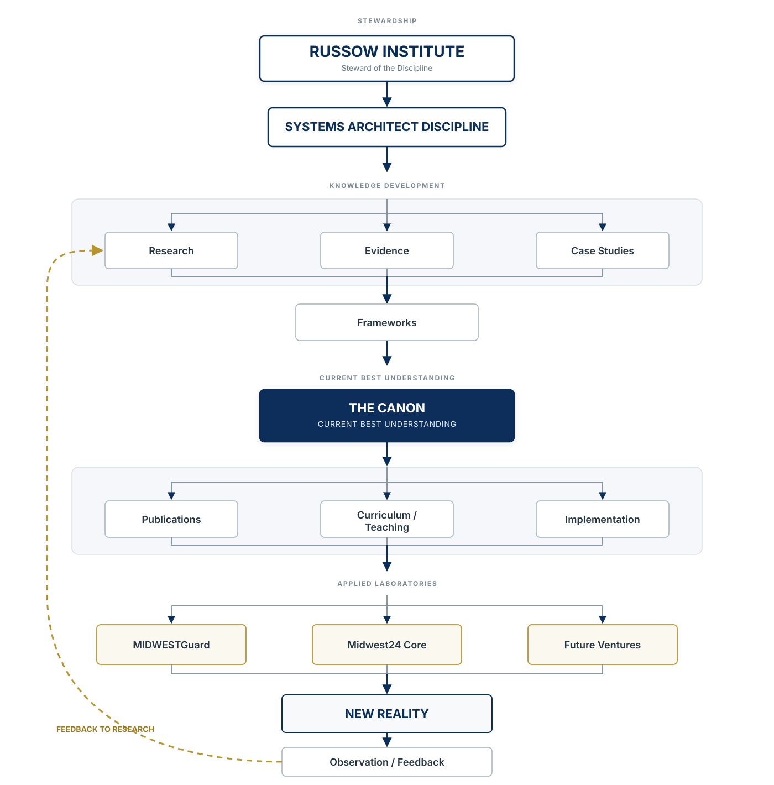

<div class="ri-flagship" markdown>

<div class="ri-institutional-kicker">RUSSOW INSTITUTE · FOUNDATIONAL ARCHITECTURE</div>

# Institute Architecture

<p class="ri-deck">
This document defines the relationship between the Russow Institute,
the Systems Architect Discipline, the Canon, and the commercial
organizations that support and apply the discipline.
</p>

<div class="ri-flagship-meta" markdown>

<div>
<span>DOCUMENT TYPE</span>
<strong>Institute Architecture</strong>
</div>

<div>
<span>STATUS</span>
<strong>Foundational</strong>
</div>

<div>
<span>VERSION</span>
<strong>1.0.0</strong>
</div>

<div>
<span>AUTHORITY</span>
<strong>Russow Institute</strong>
</div>

</div>

<div class="ri-authority-rule">
<strong>Authority:</strong> Markdown remains the authoritative source.
Visualizations are derived representations and may clarify, but may not
redefine, this architecture.
</div>

## Executive Orientation

<div class="ri-orientation-grid" markdown>

<div class="ri-orientation-item" markdown>

### Institutional Scope

The architecture connects the Russow Institute, the Systems Architect
Discipline, the Canon, and the organizations that support and apply the
discipline.

</div>

<div class="ri-orientation-item" markdown>

### Knowledge Loop

Reality informs the Canon.

The Canon informs future reality.

This creates a continuous cycle of learning.

</div>

<div class="ri-orientation-item" markdown>

### Stewardship Boundary

The purpose of the organizations is not to create the discipline.

The organizations research, apply, test, refine, fund, and steward the
discipline.

</div>

</div>

## Master Institute Map

<p class="ri-section-lead">
The master map shows how knowledge is developed, organized, applied, observed,
and returned to research.
</p>

<div class="ri-spatial-region" markdown>

{ .ri-architecture-svg }

<p class="ri-figure-caption">
<strong>Figure 1 — Master Institute Map.</strong>
Derived visualization of the authoritative architecture defined in this
document. The source Markdown remains governing.
</p>

</div>

<details class="ri-source-disclosure" markdown>
<summary>Authoritative text representation</summary>

```text
                              RUSSOW INSTITUTE
                         Steward of the Discipline
                                  │
                                  ▼
                      SYSTEMS ARCHITECT DISCIPLINE
                                  │
                                  ▼
                         KNOWLEDGE DEVELOPMENT
                                  │
              ┌───────────────────┼───────────────────┐
              │                   │                   │
              ▼                   ▼                   ▼
           Research            Evidence          Case Studies
              │                   │                   │
              └───────────────────┼───────────────────┘
                                  ▼
                              Frameworks
                                  │
                                  ▼
                               THE CANON
                      Current Best Understanding
                                  │
              ┌───────────────────┼───────────────────┐
              │                   │                   │
              ▼                   ▼                   ▼
         Publications        Curriculum /       Implementation
                               Teaching
              │                   │                   │
              └───────────────────┼───────────────────┘
                                  ▼
                         APPLIED LABORATORIES
                                  │
                 ┌────────────────┼────────────────┐
                 │                │                │
                 ▼                ▼                ▼
           MIDWESTGuard      Midwest24 Core    Future Ventures
                 │                │                │
                 └────────────────┼────────────────┘
                                  ▼
                              NEW REALITY
                                  │
                                  ▼
                       Observation / Feedback
                                  │
                                  └──────────────► Research
```

</details>

### Related Authoritative Documents

<div class="ri-related-grid" markdown>

- [Knowledge Lifecycle](KNOWLEDGE-LIFECYCLE.md) — how ideas mature.
- [Knowledge Lineage](KNOWLEDGE-LINEAGE.md) — how knowledge remains traceable.
- [Canon Structure](../canon/CANON-STRUCTURE.md) — how mature knowledge is organized.
- [Phases](../strategy/PHASES.md) — the development sequence.
- [Roadmap](../strategy/ROADMAP.md) — current strategic priorities.

</div>

### Governing Principle

!!! abstract "Reality and the Canon"
    The purpose of the organizations is not to create the discipline.

    The purpose of the organizations is to research, apply, test, refine,
    fund, and steward the discipline.

    Reality informs the Canon.

    The Canon informs future reality.

    This creates a continuous cycle of learning.

## Institutional Architecture

The simplified architecture below preserves the institutional hierarchy
represented in the source model. It is retained as an authoritative textual
representation rather than as a competing primary visualization.

<details class="ri-source-disclosure" markdown>
<summary>Simplified authoritative representation</summary>

```text
                       RUSSOW INSTITUTE
                               │
                               │
                    Steward of the Discipline
                               │
                               ▼
                 Systems Architect Discipline
                               │
                               ▼
                           THE CANON
                               │
          ┌────────────────────┼────────────────────┐
          │                    │                    │
          ▼                    ▼                    ▼
     Field Research       Frameworks          Publications
          │                    │                    │
          └────────────────────┼────────────────────┘
                               │
                        Applied Laboratories
                               │
      ┌────────────────────────┼────────────────────────┐
      │                        │                        │
      ▼                        ▼                        ▼
  MIDWESTGuard            Midwest24 Core          Future Ventures
```

</details>

---

## MIDWESTGuard

### Institutional Function

- Generate revenue.
- Serve customers.
- Develop operational excellence.
- Provide real-world data.
- Test business systems.
- Develop leadership.
- Produce case studies.
- Generate field research.

**Role:** MIDWESTGuard is a living Business Systems Laboratory.

---

## Midwest24 Core

### Institutional Function

- Transform proven systems into technology.
- Build AI-assisted operational tools.
- Capture institutional knowledge.
- Improve transferability.
- Reduce unnecessary dependence upon memory.

**Role:** Midwest24 is the Applied Systems Architecture Laboratory.

---

## Russow Institute

### Institutional Function

- Preserve.
- Research.
- Refine.
- Teach.
- Challenge.
- Improve.
- Steward.

**Stewardship boundary:** The Institute exists to protect the integrity of the
discipline rather than the interests of any individual company.

---

## The Canon

### Institutional Function

The Canon represents the current best understanding of the discipline.

It is informed by:

- Research
- Field observations
- Historical analysis
- Case studies
- Applied laboratories
- Academic literature
- Criticism
- Continuous refinement

---

## Relationship

| Institutional component | Relationship to the knowledge system |
| --- | --- |
| **MIDWESTGuard** | Funds research. |
| **Midwest24 Core** | Implements research. |
| **Russow Institute** | Preserves research. |
| **The Canon** | Organizes research. |
| **Systems Architect Discipline** | Continually improves through research. |

---

## Long-Term Vision

The architecture is designed around durable knowledge rather than permanent
dependence on any particular organization or technology.

- The organizations may change.
- Technology will change.
- Markets will change.
- Software will change.
- The Canon should continue to mature.
- The Discipline should continue to improve.
- The Institute should continue to steward the work.

---

## Foundational Principle

!!! abstract "Stewardship Principle"
    Companies are temporary.

    Disciplines can endure.

    The responsibility of every organization within this architecture is to
    leave the body of knowledge stronger than it inherited it.

</div>
