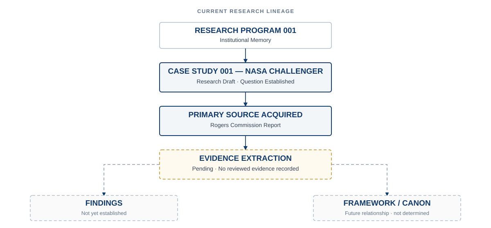
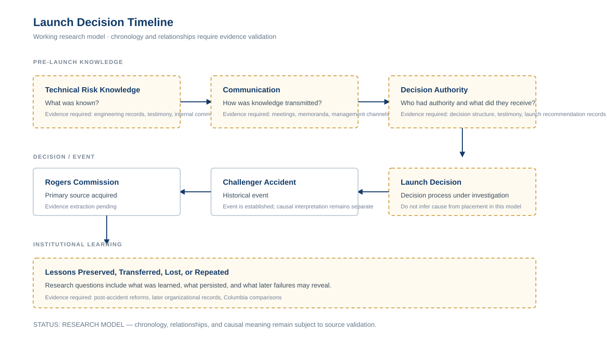
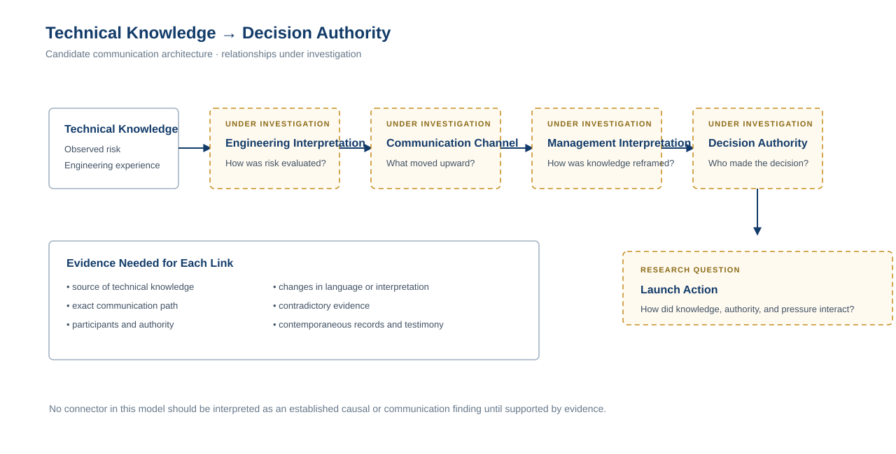
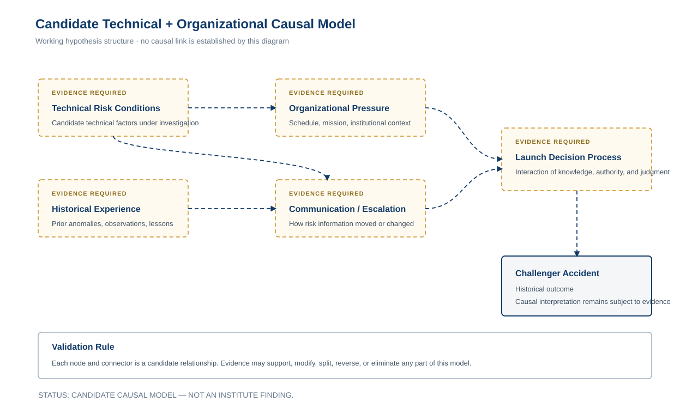
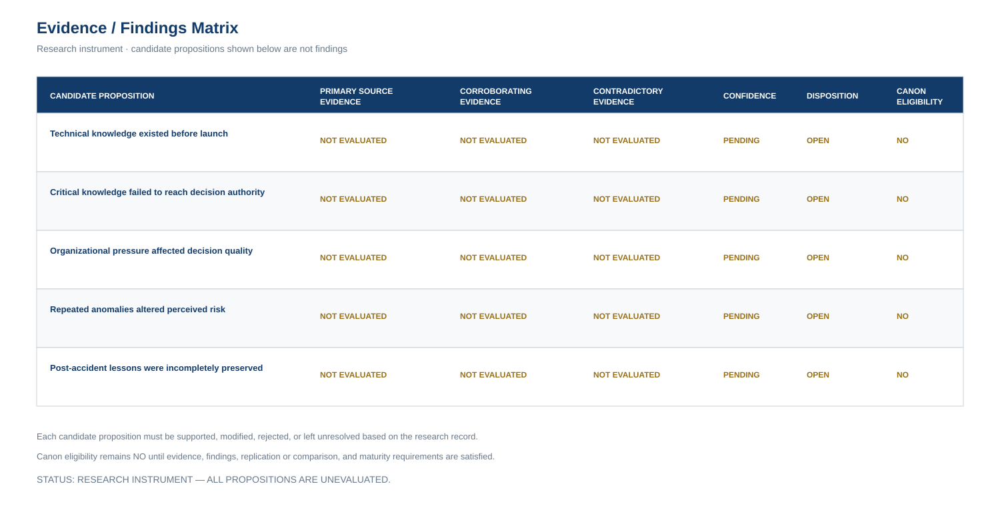

RUSSOW INSTITUTE · RESEARCH PROGRAM 001

# Case Study 001 — NASA Challenger

This research case study investigates how an organization can possess technical
knowledge yet fail to act on it effectively.

**DOCUMENT TYPE**
Research Case Study

**RESEARCH PROGRAM**
001 — Institutional Memory

**STATUS**
Research Draft

**VERSION**
0.1.0

**EVIDENCE STATE**
Primary source acquired · extraction pending

**FINDINGS STATE**
Eight findings established

**Research boundary:** This publication represents an active investigation.
The presence of a primary source does not constitute reviewed evidence, and no
conclusion presented by the Institute should be inferred until evidence has
been extracted, evaluated, and documented.

---

## Research Orientation

### Primary Question

How can an organization possess technical knowledge yet fail to act on it
effectively?

### Evidence State

The Rogers Commission Report has been acquired as a primary source.

Evidence extraction and review remain pending.

### Findings State

No findings have been established.

Current themes and questions remain investigative rather than conclusive.

---

## Research Object

The Challenger disaster is being examined as a potential case of institutional
memory failure, communication breakdown, normalization of deviance, and
organizational decision-making under pressure.

The purpose of the case study is not to presume that these interpretations are
correct. It is to test them against evidence.

### Systems Architect Relevance

This investigation may help explain how organizations fail when knowledge
exists but is not properly elevated, preserved, trusted, or acted upon.

---

## Current Research Lineage

The diagram below represents the current state of the research process. It does
not represent findings.

*Figure 1 — Current research lineage for Case Study 001. The visualization is
derived from the authoritative research state documented below.*

Authoritative research-state representation

The current lineage is:

`Research Program 001 — Institutional Memory`

↓

`Case Study 001 — NASA Challenger`

↓

`Primary Source Acquired — Rogers Commission Report`

↓

`Evidence Extraction — Pending`

↓

`Findings — Not Established`

↓

`Framework / Canon Relationship — Not Determined`

This representation is authoritative. The diagram above is a derived
visualization.

---

## Research Models Under Evaluation

!!! caution "Interpretation Boundary"

    The following diagrams are research instruments.

    They organize candidate relationships, questions, and propositions for
    investigation.

    They do **not** represent established findings.

    Every relationship shown is subject to primary-source validation,
    contradictory evidence, revision, or rejection.

### Launch Decision Timeline

The timeline organizes the major research stages and evidence questions around
technical knowledge, communication, decision authority, the launch decision,
the accident, investigation, and later institutional learning.

*Figure 2 — Working launch-decision timeline. Chronology and relationships
remain subject to evidence validation.*

### Technical Knowledge to Decision Authority

This model structures the central research question around how technical
knowledge may move through interpretation, communication, management, and
decision authority.

*Figure 3 — Candidate communication and decision architecture. Connectors
represent relationships to investigate, not established findings.*

### Candidate Technical and Organizational Causal Model

This model organizes potential technical and organizational relationships that
may require testing against the research record.

*Figure 4 — Candidate causal model. Every node and connector remains subject
to evidence validation, revision, or rejection.*

### Evidence and Findings Matrix

The matrix provides a research instrument for moving candidate propositions
through evidence review without confusing hypothesis with finding.

*Figure 5 — Evidence and findings matrix. All candidate propositions are
currently unevaluated.*

The matrix is intentionally incomplete.

Its purpose is to create visible discipline around the transition from:

`Candidate proposition → Evidence → Finding → Framework → Canon eligibility`

---

## Source and Evidence State

### Primary Source Acquired

**Report of the Presidential Commission on the Space Shuttle Challenger
Accident** — commonly referred to as the Rogers Commission Report — is preserved
in the Research Program 001 primary-source library.

Its acquisition establishes source availability.

It does **not** establish evidentiary conclusions.

### Evidence Extraction

The repository contains an evidence summary and a Rogers Commission evidence
note prepared for extraction.

At the current research state:

- the primary source has been acquired;
- evidence categories have been identified;
- extraction questions have been established;
- reviewed evidence has not yet been recorded;
- supporting findings have not been established;
- contradictory findings have not been established.

### Findings

Eight Challenger findings are established from the current Rogers Commission evidence record by this case study.

The research publication must therefore distinguish working themes from
supported conclusions.

---

## Questions to Investigate

1. What knowledge existed before the disaster?
2. Who possessed that knowledge?
3. How was the knowledge communicated?
4. Where did the communication system fail?
5. What pressures influenced the decision-making environment?
6. What lessons were preserved afterward?
7. Which lessons were later forgotten or repeated?

---

## Working Themes

The following themes define areas of investigation. They are not findings.

- institutional memory;
- technical risk;
- communication failure;
- decision authority;
- organizational pressure;
- normalization of deviance;
- evidence suppression;
- leadership responsibility.

---

## Evidence Required

The investigation currently identifies the following evidence requirements:

- Rogers Commission Report;
- NASA internal communications;
- engineering testimony;
- launch decision timeline;
- organizational analysis;
- later Columbia investigation comparisons.

Acquisition, extraction, validation, and interpretation are separate research
states. An item appearing in this list should not be interpreted as reviewed
evidence unless its evidence record states otherwise.

---

------------------------------------------------------------------------------

# Established Challenger Findings

**Status:** Established Challenger case-study findings.

These eight findings have completed:

- structured evidence extraction;
- cross-chapter synthesis;
- findings eligibility review;
- adversarial findings validation;
- findings revision;
- establishment review.

They are established **only as bounded findings of the Challenger case**.

They must not be treated as:

- Institutional Memory framework propositions;
- Institute principles;
- cross-case laws;
- axioms;
- theorems;
- Canon.

F8 — technical uncertainty remains a mandatory cross-cutting qualifier.

F10 — Selective Conversion Failure remains a synthesis-level construct and is
not promoted here.

CF-09 — Institutional Possession and Decision Availability remains at the
synthesis level and is not established as an independent finding.

## CF-01 — Relevant Technical Knowledge Existed Before 51-L

**Established finding**

Before mission 51-L, NASA and Morton Thiokol possessed substantial documented
technical knowledge concerning Solid Rocket Motor field-joint behavior,
O-ring erosion and blow-by, joint rotation, criticality, temperature-related
concerns, prior flight anomalies, and potentially catastrophic seal failure.

This knowledge was distributed unevenly, and the record does not establish
that every participant possessed or understood every part of it.

**Primary evidence**

- CH6-E02
- CH6-E03
- CH6-E05
- CH6-E06
- CH6-E08
- CH6-E09
- CH6-E12
- CH6-E14
- CH5-E05
- CH5-E07
- CH4-E14

**Mandatory qualification**

- CH5-Q01
- CH6-Q01
- CH6-Q02
- CH6-Q03
- CH6-Q05

**Boundary**

This finding does not establish:

- universal individual knowledge;
- complete pre-51-L understanding of the failure mechanism;
- universal agreement concerning temperature effects;
- foreknowledge of the exact 51-L failure sequence.

**Eligibility source**

F1 — Challenger Findings Eligibility Review

---

## CF-02 — Institutional Possession Did Not Produce Common Decision-Level Awareness

**Established finding**

Relevant O-ring and field-joint knowledge existed within NASA and Morton
Thiokol, but material portions of the anomaly history, engineering concerns,
and risk information were absent from or incompletely represented in important
higher-level readiness and launch-decision channels for 51-L.

**Primary evidence**

- CH5-E01
- CH5-E02
- CH5-E03
- CH5-E04
- CH5-E06
- CH6-E04
- CH6-E08
- CH6-E14
- CH7-E09
- CH7-E10
- CH7-E15
- CH7-E16
- CH2-E08
- CH2-E18

**Mandatory qualification**

- CH5-Q04
- CH6-Q05
- CH7-Q01
- CH7-Q04

The evidence distinguishes among:

- lack of receipt;
- failure to forward;
- incomplete representation;
- inaccurate representation;
- different interpretation.

Those states must not be collapsed.

**Boundary**

This finding does not state that every senior official was wholly uninformed.

**Eligibility source**

F2 — Challenger Findings Eligibility Review

---

## CF-03 — Risk Significance Was Not Preserved Consistently

**Established finding**

Across the pre-51-L Shuttle reporting and decision system, the documented
severity and operational significance of the O-ring problem were represented
inconsistently across records, organizational levels, and decision forums.

**Primary evidence**

- CH6-E06
- CH6-E07
- CH6-E09
- CH6-E10
- CH7-E08
- CH7-E12
- CH7-E14
- CH7-E15
- CH7-E16

**Qualifying evidence**

- CH6-Q02
- CH6-Q03
- CH6-Q04
- CH7-Q04

**Boundary**

This finding describes an information and decision-process condition.

It does not establish deliberate suppression, deception, or malicious intent.

**Eligibility source**

F3 — Challenger Findings Eligibility Review

---

## CF-04 — Escalation Did Not Reliably Deliver the Complete Risk Picture

**Established finding**

Formal and informal escalation processes did not reliably place material
O-ring concerns, anomaly history, and launch-constraint information before the
higher-level authorities responsible for readiness and launch decisions.

**Primary evidence**

- CH5-E03
- CH5-E06
- CH5-E10
- CH6-E10
- CH7-E01
- CH7-E05
- CH7-E06
- CH7-E16
- CH2-E08

**Qualifying evidence**

- CH5-Q02
- CH5-Q04
- CH6-Q04

**Boundary**

This finding does not establish that successful escalation necessarily would
have prevented Challenger.

It also does not assign the broader escalation failure to one person or one
event.

**Eligibility source**

F4 — Challenger Findings Eligibility Review

---

## CF-05 — Safety Architecture Did Not Provide Effective Redundancy for the O-Ring Risk

**Established finding**

For the O-ring problem relevant to 51-L, Shuttle safety, reliability, and
quality-assurance structures did not provide effective independent redundancy
against failures in problem reporting, trend analysis, criticality
representation, information distribution, and participation in critical
launch-decision forums.

**Primary evidence**

- CH7-E01
- CH7-E02
- CH7-E03
- CH7-E04
- CH7-E05
- CH7-E06
- CH7-E07
- CH7-E09
- CH7-E10
- CH7-E11
- CH7-E12
- CH7-E13
- CH7-E16
- CH7-E19
- CH7-E20

**Mandatory qualification**

- CH7-Q01
- CH7-Q02
- CH7-Q05
- CH9-Q06

NASA possessed formal safety structures, and some safety and learning
mechanisms provided real institutional value.

**Boundary**

This finding does not establish that:

- NASA lacked a safety system;
- every safety organization was ineffective;
- safety-system failure alone caused Challenger;
- a different safety structure certainly would have prevented the accident.

**Eligibility source**

F5 — Challenger Findings Eligibility Review

---

## CF-06 — Repeated Success Coexisted With Increasing Acceptance of O-Ring Anomalies

**Established finding**

Before 51-L, successful Shuttle missions continued alongside repeated O-ring
erosion, blow-by, launch-constraint waivers, and other field-joint anomalies,
while the amount of documented degradation treated as acceptable for continued
flight increased.

**Primary evidence**

- CH6-E01
- CH6-E07
- CH6-E08
- CH6-E09
- CH6-E10
- CH7-E12
- CH7-E14

**Comparative support**

- CH9-E13

**Mandatory qualification**

- CH6-Q01
- CH6-Q02
- CH6-Q03
- CH6-Q04
- CH4-Q02
- CH4-Q04

The record also contains:

- legitimate engineering rationale;
- formal certification;
- technical uncertainty;
- continued investigation;
- corrective activity.

**Boundary**

This finding does not itself establish:

- normalization of deviance;
- complacency;
- recklessness;
- intentional risk acceptance.

Those are interpretations beyond the historical proposition stated here.

**Eligibility source**

F6 — Challenger Findings Eligibility Review

---

## CF-07 — Schedule and Resource Pressure Constrained Organizational Capacity

**Established finding**

Before Challenger, the Shuttle program operated under substantial flight-rate,
workload, staffing, logistics, customer, and resource pressures. The
Commission documented effects including compressed training, extreme workload,
reduced resource margin, displacement of long-term capability work by
immediate operations, spare-parts shortages, and reduced time to analyze
anomalies between missions.

**Primary evidence**

- CH8-E01
- CH8-E02
- CH8-E03
- CH8-E04
- CH8-E06
- CH8-E07
- CH8-E08
- CH8-E10
- CH8-E11
- CH8-E12
- CH8-E13
- CH8-E15
- CH8-E16
- CH8-E17
- CH8-E19
- CH8-E20

**Mandatory qualification**

- CH8-Q01
- CH8-Q02
- CH8-Q03
- CH8-Q04
- CH8-Q05
- CH2-Q03
- CH2-Q04
- CH2-Q05

**Boundary**

This finding establishes an institutional operating environment.

It does not establish that:

- outside political pressure caused launch;
- customers forced the launch;
- NASA categorically refused schedule delays;
- schedule pressure directly caused Thiokol's recommendation reversal;
- schedule pressure alone caused Challenger.

**Finding classification**

Contextual finding

**Eligibility source**

F7 — Challenger Findings Eligibility Review

---

## CF-08 — NASA Recognized and Acted on Hazards in Other Shuttle Safety Domains

**Established finding**

Outside the O-ring causal chain, NASA demonstrated the ability to recognize
some hazards, delay or alter operations, conduct technical reviews, impose
restrictions, and pursue corrective actions.

**Primary evidence**

- CH2-Q05
- CH7-Q02
- CH8-Q03
- CH9-E12
- CH9-Q03
- CH9-Q04
- CH9-Q06

**Critical boundary**

CH9-Q01 establishes that the Chapter IX safety matters used as comparative
evidence played no part in causing 51-L.

**Boundary**

This finding does not establish that:

- NASA's organizational learning systems generally worked well;
- successful learning elsewhere negates failures surrounding the O-ring risk;
- Chapter IX conditions caused Challenger.

**Finding classification**

Comparative / counterevidence finding

**Eligibility source**

F9 — Challenger Findings Eligibility Review

---

# Cross-Cutting Qualification — Technical Uncertainty

F8 remains a mandatory interpretive qualification rather than a standalone
provisional finding.

The pre-51-L record contained genuine technical uncertainty and legitimate
engineering disagreement.

Relevant qualifying evidence includes:

- CH5-Q01
- CH5-Q03
- CH5-Q04
- CH6-Q01
- CH6-Q02
- CH6-Q03
- CH4-Q01
- CH4-Q02
- CH4-Q04

The provisional findings therefore must not be read as implying:

- perfect technical knowledge;
- unanimous engineering interpretation;
- complete certainty about temperature effects;
- perfect predictability of the 51-L physical failure sequence.

Technical uncertainty constrains the findings.

It does not erase independently documented failures of reporting,
classification, trend analysis, escalation, information distribution, and
safety participation.

------------------------------------------------------------------------------

# Held Synthesis Construct — Selective Conversion Failure

F10 remains held at synthesis level.

**Selective Conversion Failure** is not promoted into the Challenger findings
layer.

The phrase remains:

- Institute-generated;
- analytically useful;
- unvalidated as a general construct;
- untested across cases.

The nine provisional findings must stand independently without requiring F10
to be true.

------------------------------------------------------------------------------

## CF-09 — Institutional Possession and Decision Availability

CF-09 was removed from the provisional findings layer during adversarial
validation.

Its underlying proposition remains strongly supported, but it is retained at
the synthesis level because it integrates the empirical content of CF-01
through CF-04 and introduces meaningful framework-leakage risk.

CF-09 is not eligible for establishment in this pass.

# Established Findings State

Eight Challenger findings are established:

1. CF-01 — Relevant Technical Knowledge Existed Before 51-L
2. CF-02 — Institutional Possession Did Not Produce Common Decision-Level Awareness
3. CF-03 — Risk Significance Was Not Preserved Consistently
4. CF-04 — Escalation Did Not Reliably Deliver the Complete Risk Picture
5. CF-05 — Safety Architecture Did Not Provide Effective Redundancy for the O-Ring Risk
6. CF-06 — Repeated Success Coexisted With Increasing Acceptance of O-Ring Anomalies
7. CF-07 — Schedule and Resource Pressure Constrained Organizational Capacity
8. CF-08 — NASA Demonstrated Capacity for Organizational Learning in Other Domains

These eight findings are established Challenger case-study findings.

Their establishment is bounded to this case and this evidence record.

------------------------------------------------------------------------------

# Next Research Gate

The next research state is:

**Post-Establishment Challenger Research Review — Pass 1**

The established findings must now be evaluated for research implications
without automatically promoting any proposition into the Institutional Memory
framework.

The next review should determine:

1. which findings are purely historical;
2. which findings are organizational-process findings;
3. which findings are contextual or comparative;
4. which findings create cross-case research questions;
5. which synthesis propositions remain unvalidated;
6. what evidence is still required before framework development;
7. whether Challenger should now be compared with another case;
8. whether any candidate Institutional Memory proposition is mature enough
   even to enter framework-development review.

No framework proposition is created by this state change.

------------------------------------------------------------------------------

# Governance Boundary

Nothing in this section authorizes:

- Institutional Memory framework advancement;
- promotion of Selective Conversion Failure;
- cross-case generalization;
- axiom formation;
- theorem formation;
- Canon advancement.

The evidence hierarchy remains:

**primary source → evidence → synthesis → eligibility → provisional findings → validated findings → framework → Canon**

## Current Limitations

!!! warning "Research Status"

    This is a research draft.

    No conclusions should be treated as final until supported by evidence.

Current limitations include:

- the acquired Rogers Commission Report has not yet been fully extracted into
  the evidence record;
- the evidence summary records no reviewed evidence;
- no case-study findings have been established;
- additional identified primary and secondary sources remain to be acquired or
  reviewed;
- the relationship between this case study and the Institutional Memory
  Lifecycle framework remains subject to evidence;
- no proposition from this case study is presented as Canon.

---

## Related Research

### Research Program

**Research Program 001 — Institutional Memory** investigates how organizations
acquire, preserve, lose, and transfer knowledge.

### Related Concepts

- Institutional Memory
- Knowledge Operating System
- Decision Systems
- Stewardship
- Organizational Risk
- Evidence Quality
- Communication Architecture

### Research Relationships

| Research object | Current relationship |
| --- | --- |
| Rogers Commission Report | Acquired primary source |
| Evidence Summary 001 — NASA Challenger | Evidence collection structure; extraction incomplete |
| Evidence Note 002 — Rogers Commission Report | Prepared for primary-source extraction |
| Institutional Memory Lifecycle | Related framework; relationship remains provisional |
| Institutional Memory paper | Related research publication |
| The Canon | No established relationship from this case study |

---

## Research Principle

> **Evidence outranks interpretation.**
>
> Source acquisition, evidence extraction, findings, frameworks, and Canon are
> distinct states. Advancement from one state to another requires support from
> the research record.

